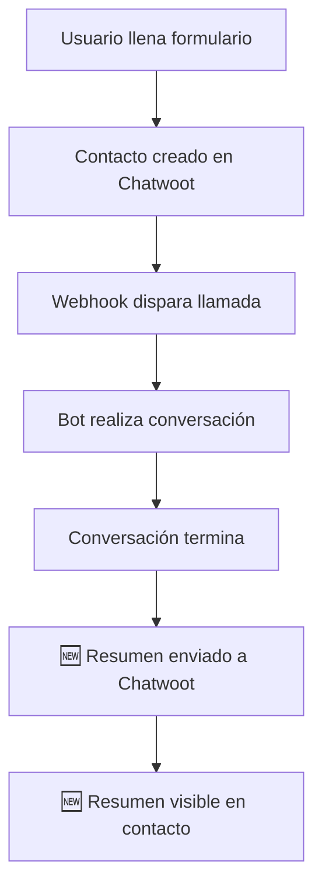

# 📋 Plan de Integración: Resumen de Conversación Bot → Chatwoot Cloud

## 🎯 Objetivo
Enviar automáticamente el resumen de cada conversación del bot de voz TDX a Chatwoot Cloud como información consultable del contacto.

## 🔍 Análisis de la Situación

### ✅ Lo que YA tienes:
- Integración con Chatwoot Cloud funcionando
- Credenciales configuradas:
  - `VITE_CHATWOOT_ACCOUNT_ID=126521`
  - `VITE_CHATWOOT_API_TOKEN=PNwLGXoDiJ22QKd4AzX9Xxof`
  - `VITE_CHATWOOT_INBOX_ID=VeyqnrFYMM2kbX7GXHKCzDVM`
- Webhook receiver para llamadas salientes
- Creación automática de contactos desde landing page

### ❌ Lo que NO existe:
- API específica para "Contact Notes" en Chatwoot
- Integración para enviar resúmenes de conversación

## 💡 Solución Implementada

### **Estrategia: Custom Attributes + Conversaciones**

Como Chatwoot NO tiene API específica para Contact Notes, usamos dos métodos:

1. **Método Principal**: `custom_attributes` - Almacena el resumen como atributos del contacto
2. **Método Alternativo**: Crear conversación con mensaje - Crea una conversación con el resumen

## 🛠️ Implementación

### **1. Archivo Principal: `chatwoot_summary_integration.py`**

```python
from chatwoot_summary_integration import send_bot_summary_to_chatwoot

# Uso simple
result = send_bot_summary_to_chatwoot(
    phone_number="+573001234567",
    conversation_summary="Resumen de la conversación...",
    call_duration="8 minutos",
    call_outcome="Reunión agendada"
)
```

### **2. Funcionalidades Principales**

#### **A. Búsqueda de Contacto**
- Busca contacto por número de teléfono
- Maneja diferentes formatos de teléfono
- Usa endpoint `/contacts/search`

#### **B. Actualización con Custom Attributes**
```python
custom_attributes = {
    'last_bot_conversation_summary': conversation_summary,
    'last_bot_call_date': timestamp,
    'bot_interaction_status': 'completed',
    'last_call_duration': call_duration,
    'last_call_outcome': call_outcome
}
```

#### **C. Creación de Conversación (Alternativo)**
- Crea nueva conversación
- Envía mensaje con resumen formateado
- Marca conversación como resuelta

## 📊 Estructura de Datos

### **Custom Attributes que se almacenan:**
- `last_bot_conversation_summary`: Resumen completo de la conversación
- `last_bot_call_date`: Fecha y hora de la llamada
- `bot_interaction_status`: Estado de la interacción (completed, failed, etc.)
- `last_call_duration`: Duración de la llamada
- `last_call_outcome`: Resultado de la llamada

## 🚀 Integración con el Bot Actual

### **Opción 1: Integración Directa en `agent.py`**

```python
# Al final de la conversación en agent.py
from chatwoot_summary_integration import send_bot_summary_to_chatwoot

# Dentro de la clase TDXSDRBot
async def end_conversation(self, conversation_summary: str, phone_number: str):
    """Envía resumen a Chatwoot al finalizar conversación"""
    
    # Enviar resumen a Chatwoot
    result = send_bot_summary_to_chatwoot(
        phone_number=phone_number,
        conversation_summary=conversation_summary,
        call_duration=self.get_call_duration(),
        call_outcome=self.get_call_outcome()
    )
    
    if result:
        logger.info("✅ Resumen enviado a Chatwoot")
    else:
        logger.error("❌ Error enviando resumen a Chatwoot")
```

### **Opción 2: Webhook Independiente**

```python
# Crear endpoint en webhook_receiver.py
@app.post("/conversation-summary")
async def receive_conversation_summary(request: Request):
    """Recibe resumen de conversación y lo envía a Chatwoot"""
    
    data = await request.json()
    
    result = send_bot_summary_to_chatwoot(
        phone_number=data['phone_number'],
        conversation_summary=data['summary'],
        call_duration=data.get('duration'),
        call_outcome=data.get('outcome')
    )
    
    return {"success": result}
```

## 🔧 Configuración Requerida

### **1. Variables de Entorno**
Las credenciales ya están configuradas:
```bash
VITE_CHATWOOT_ACCOUNT_ID=126521
VITE_CHATWOOT_API_TOKEN=PNwLGXoDiJ22QKd4AzX9Xxof
VITE_CHATWOOT_INBOX_ID=VeyqnrFYMM2kbX7GXHKCzDVM
```

### **2. Dependencias**
```bash
pip install requests
```

## 📋 Flujo de Trabajo Completo

### **Flujo Actual → Flujo Mejorado**



### **Después de la implementación:**
1. **Usuario llena formulario** → Contacto creado
2. **Bot realiza llamada** → Conversación completa
3. **Conversación termina** → Resumen generado
4. **Resumen enviado** → Almacenado en custom_attributes
5. **Agente humano** → Puede ver resumen en Chatwoot

## 📍 Dónde se Ve el Resumen

### **En Custom Attributes:**
- Perfil del contacto → Sección "Custom Attributes"
- Campos visibles:
  - `last_bot_conversation_summary`
  - `last_bot_call_date`
  - `bot_interaction_status`

### **En Conversaciones (Método Alternativo):**
- Lista de conversaciones del contacto
- Conversación con título "Resumen Bot TDX"
- Mensaje formateado con toda la información

## 🧪 Testing y Validación

### **1. Test Manual**
```python
# Ejecutar el archivo directamente
python chatwoot_summary_integration.py
```

### **2. Test con Datos Reales**
```python
from chatwoot_summary_integration import send_bot_summary_to_chatwoot

# Usar número de teléfono real de un contacto existente
result = send_bot_summary_to_chatwoot(
    phone_number="+573001234567",  # Número real
    conversation_summary="Test de integración",
    call_duration="2 minutos",
    call_outcome="Test exitoso"
)
```

### **3. Verificación en Chatwoot**
1. Ir a Contacts en Chatwoot
2. Buscar el contacto por teléfono
3. Verificar que aparezcan los custom attributes
4. Confirmar que la información esté actualizada

## 🔄 Mantenimiento y Monitoreo

### **Logs Importantes**
```python
# Logs de éxito
[INFO] Contacto encontrado: Ana Ortiz (ID: 12345)
[INFO] ✅ Resumen actualizado para contacto 12345

# Logs de error
[ERROR] No se encontró contacto con teléfono: +573001234567
[ERROR] Error actualizando contacto: 401 - Unauthorized
```

### **Métricas a Monitorear**
- Número de resúmenes enviados exitosamente
- Errores de autenticación
- Contactos no encontrados
- Tiempo de respuesta de la API

## 📚 Documentación de Referencia

### **APIs Utilizadas**
- `GET /api/v1/accounts/{account_id}/contacts/search` - Buscar contactos
- `PUT /api/v1/accounts/{account_id}/contacts/{id}` - Actualizar contacto
- `POST /api/v1/accounts/{account_id}/conversations` - Crear conversación
- `POST /api/v1/accounts/{account_id}/conversations/{id}/messages` - Enviar mensaje

### **Limitaciones Conocidas**
- No hay API específica para Contact Notes
- Los custom attributes tienen límite de caracteres
- Búsqueda de contactos puede ser lenta con muchos registros

## 🎯 Próximos Pasos

1. **Implementar** la integración en `agent.py`
2. **Testear** con llamadas reales
3. **Monitorear** logs y métricas
4. **Optimizar** según feedback

---

## 📞 Soporte

Si tienes problemas con la implementación:
1. Verificar logs en `chatwoot_summary_integration.py`
2. Confirmar que las credenciales sean correctas
3. Testear conectividad con la API de Chatwoot
4. Verificar que los contactos existan en Chatwoot

---

**¡La integración está lista para implementar!** 🚀

El resumen de cada conversación del bot ahora se almacenará automáticamente en Chatwoot Cloud y será consultable por tu equipo de ventas.