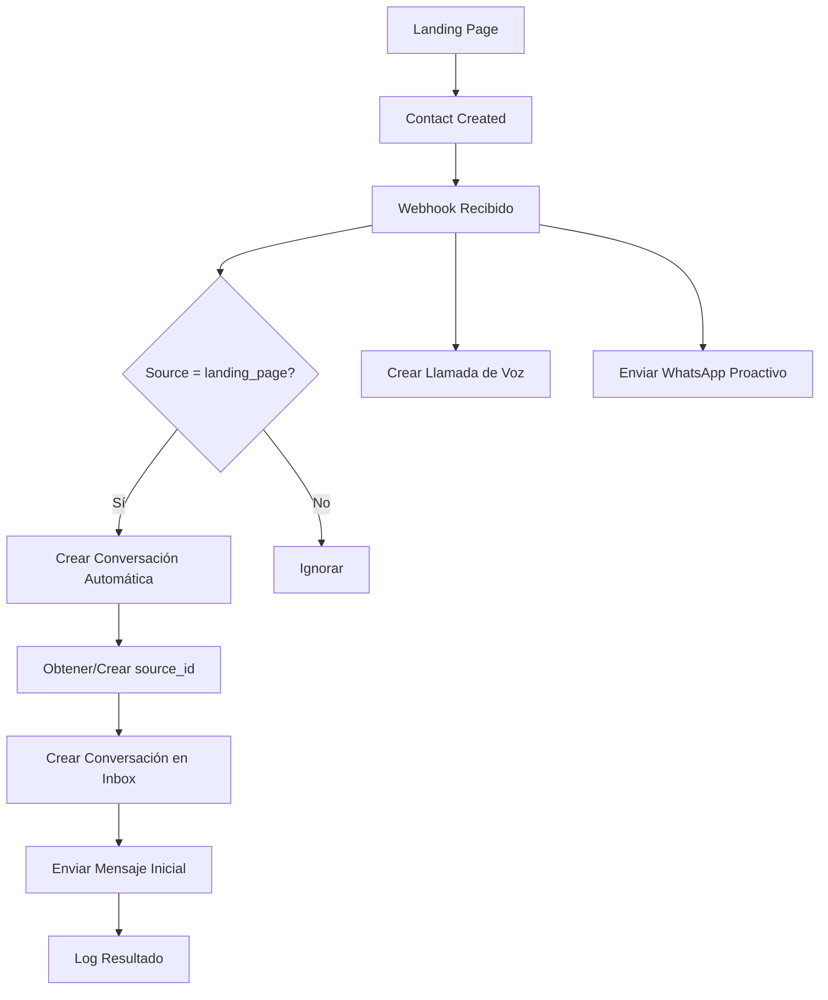

# 🆕 CONFIGURACIÓN DE CONVERSACIONES AUTOMÁTICAS PARA WEBHOOKS

## 📋 DESCRIPCIÓN

Esta nueva funcionalidad crea automáticamente conversaciones en Chatwoot cuando se reciben webhooks de `contact_created` desde landing page. Permite tener visibilidad completa de todos los leads generados y las acciones automáticas realizadas.

## 🚀 CARACTERÍSTICAS IMPLEMENTADAS

### ✅ Funcionalidades Principales

1. **Creación Automática de Conversaciones**
   - Se activa cuando llega webhook `contact_created` con source `landing_page`
   - Crea conversación en inbox específico (configurable)
   - Ejecuta en paralelo con llamada de voz y WhatsApp proactivo

2. **Mensaje Inicial Informativo**
   - Muestra información completa del contacto
   - Detalla acciones automáticas iniciadas
   - Incluye próximos pasos recomendados
   - Formato profesional y estructurado

3. **Manejo Robusto de Errores**
   - Reintentos automáticos con backoff exponencial
   - Fallback a source_id temporal si no existe asociación
   - Logs detallados para debugging
   - No bloquea otras funcionalidades si falla

4. **Configuración Flexible**
   - Feature flag para habilitar/deshabilitar
   - Inbox configurable vía variable de entorno
   - Integración no invasiva con código existente

## ⚙️ CONFIGURACIÓN REQUERIDA

### 1. Variables de Entorno

Agregar a tu archivo `.env.local`:

```bash
# 🆕 NUEVA FUNCIONALIDAD: Conversaciones automáticas para webhooks
CREATE_WEBHOOK_CONVERSATIONS_ENABLED=true

# Inbox específico para conversaciones de webhook (ID del inbox watdxv3)
CHATWOOT_WEBHOOK_INBOX_ID=tu_inbox_watdxv3_id_aqui
```

### 2. Obtener ID del Inbox watdxv3

#### Opción A: Desde la URL de Chatwoot
1. Ve a tu Chatwoot dashboard
2. Navega al inbox watdxv3
3. La URL será algo como: `https://app.chatwoot.com/app/accounts/126521/inbox/69704`
4. El último número (69704) es tu INBOX_ID

#### Opción B: Desde la API de Chatwoot
```bash
curl -X GET \
  "https://app.chatwoot.com/api/v1/accounts/TU_ACCOUNT_ID/inboxes" \
  -H "api_access_token: TU_API_TOKEN"
```

### 3. Configuración del Webhook en Chatwoot

Asegúrate de que tu webhook de Chatwoot esté configurado para enviar eventos `contact_created`:

1. Ve a Settings → Integrations → Webhooks
2. URL: `https://tu-dominio.com/webhooks/chatwoot/TU_TOKEN`
3. Eventos: Seleccionar `Contact Created`

## 🔄 FLUJO DE FUNCIONAMIENTO



## 📝 FORMATO DEL MENSAJE INICIAL

```
🎯 **NUEVO CONTACTO - LANDING PAGE**

📊 **INFORMACIÓN DEL CONTACTO**
• **Nombre:** Juan Pérez
• **Teléfono:** +573001234567
• **Email:** juan@empresa.com
• **Empresa:** Mi Empresa SAS
• **Fuente:** Landing Page
• **Recibido:** 28/07/2025 14:30

🚀 **ACCIONES AUTOMÁTICAS INICIADAS**
• ✅ Llamada de voz programada con bot Mati
• ✅ Mensaje proactivo de WhatsApp enviado
• ✅ Conversación creada automáticamente en Chatwoot

📱 **ESTADO DEL PROCESO**
• **Bot de voz:** Intentando contactar al cliente
• **Fallback:** WhatsApp automático si no responde llamada
• **Seguimiento:** Requerido por equipo de ventas

💡 **PRÓXIMOS PASOS RECOMENDADOS**
• Monitorear respuesta del cliente en WhatsApp
• Preparar información adicional según interés mostrado
• Asignar agente humano si el bot requiere transferencia

---
📅 **Generado automáticamente:** 28/07/2025 14:30
🤖 **Por:** Sistema de Webhook TDX
```

## 🔍 MONITOREO Y DEBUGGING

### Health Check
```bash
curl https://tu-dominio.com/health
```

Verifica el campo `webhook_conversations_enabled` en la respuesta.

### Logs Importantes
```
🆕 Iniciando creación de conversación automática en Chatwoot...
✅ Conversación automática creada: ID 12345
❌ Error creando conversación automática: api_error_400
```

### Test Manual
```bash
# Enviar webhook de prueba
curl -X POST \
  "https://tu-dominio.com/webhooks/chatwoot/TU_TOKEN" \
  -H "Content-Type: application/json" \
  -d '{
    "event": "contact_created",
    "id": 123,
    "name": "Test Contact",
    "phone_number": "+573001234567",
    "email": "test@example.com",
    "custom_attributes": {
      "source": "landing_page",
      "company_name": "Test Company"
    }
  }'
```

## 🐛 TROUBLESHOOTING

### Error: "No source_id found"
```bash
# Verificar asociaciones de contacto
curl -X GET \
  "https://app.chatwoot.com/api/v1/accounts/ACCOUNT_ID/contacts/CONTACT_ID/contactable_inboxes" \
  -H "api_access_token: API_TOKEN"
```

### Error: "Invalid inbox_id"
- Verificar que `CHATWOOT_WEBHOOK_INBOX_ID` sea correcto
- Asegurar que el inbox existe y es accesible con el API token

### Error: "Conversation creation failed"
- Verificar permisos del API token
- Confirmar que el contacto existe en Chatwoot
- Revisar logs detallados en el servidor

## 🔧 ARCHIVOS MODIFICADOS

### chatwoot_summary_integration.py
- ✅ Método `create_conversation_for_webhook_contact()`
- ✅ Método `format_webhook_contact_message()`
- ✅ Método `get_contact_inbox_source_id_for_inbox()`
- ✅ Método `create_webhook_conversation_with_retry()`

### webhook_receiver.py
- ✅ Feature flag `CREATE_WEBHOOK_CONVERSATIONS`
- ✅ Función `create_chatwoot_conversation_for_webhook()`
- ✅ Integración en flujo principal de webhooks
- ✅ Health check actualizado

### .env.example
- ✅ Variables de configuración agregadas
- ✅ Documentación de nuevas variables

## 📊 MÉTRICAS DE PERFORMANCE

La funcionalidad está optimizada para:
- ⚡ **Tiempo de respuesta**: < 3 segundos
- 🔄 **Reintentos**: Máximo 3 intentos con backoff
- 🚫 **No bloqueo**: Ejecuta en paralelo con otras acciones
- 📝 **Logging completo**: Para monitoreo y debugging

## ✅ VALIDACIÓN DE IMPLEMENTACIÓN

- [x] Creación automática de conversaciones
- [x] Mensaje inicial informativo y profesional
- [x] Manejo robusto de errores con reintentos
- [x] Feature flag para habilitar/deshabilitar
- [x] Configuración flexible de inbox
- [x] Integración no invasiva
- [x] Documentación completa
- [x] Variables de entorno actualizadas
- [x] Health check con nueva funcionalidad

## 🚀 PRÓXIMOS PASOS

1. **Configurar** `CHATWOOT_WEBHOOK_INBOX_ID` con el ID real del inbox watdxv3
2. **Habilitar** `CREATE_WEBHOOK_CONVERSATIONS_ENABLED=true`
3. **Monitorear** logs para verificar funcionamiento
4. **Ajustar** mensaje inicial según necesidades específicas
5. **Considerar** métricas adicionales para analytics